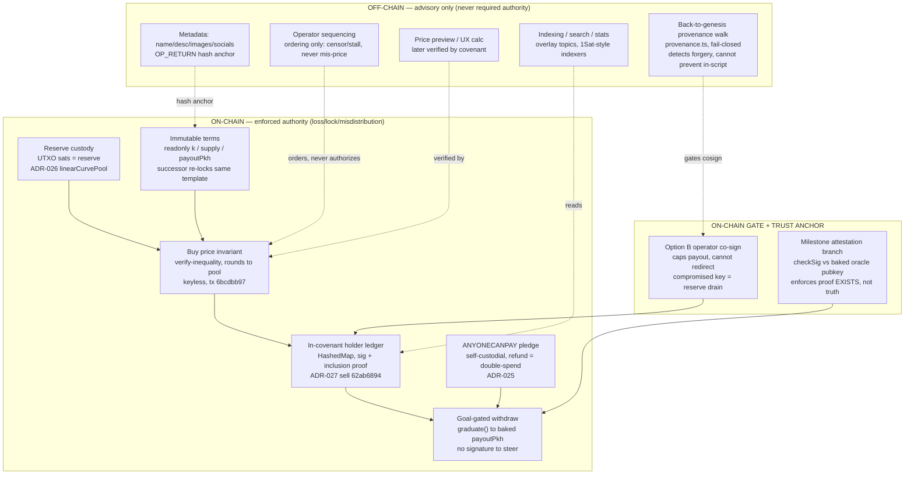
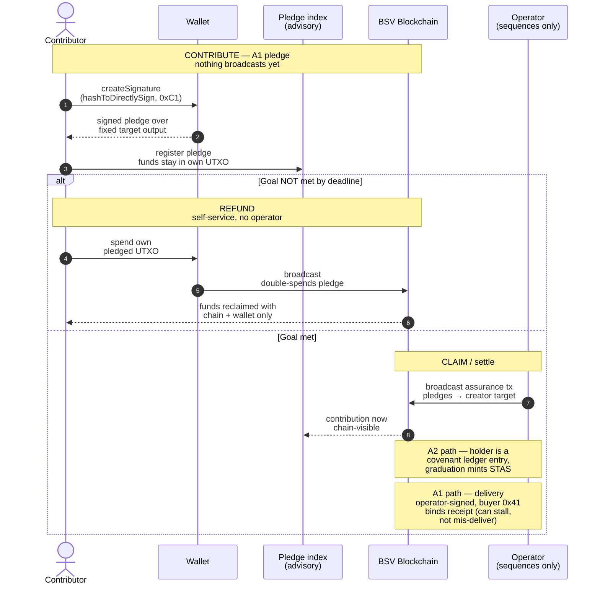
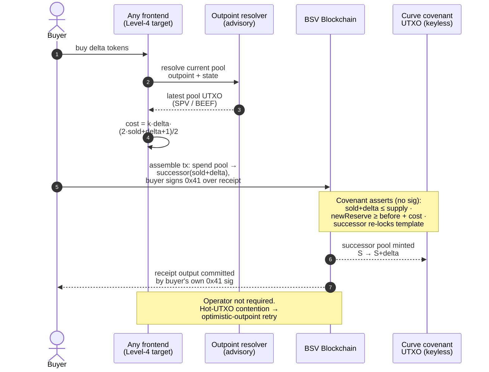
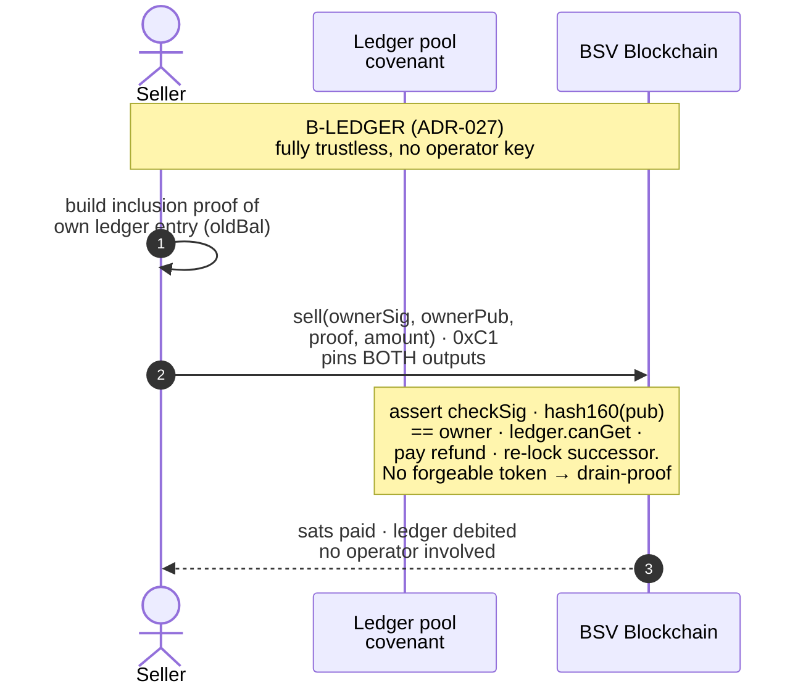
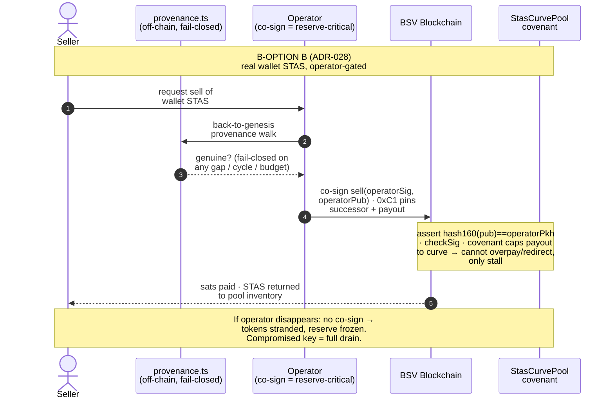
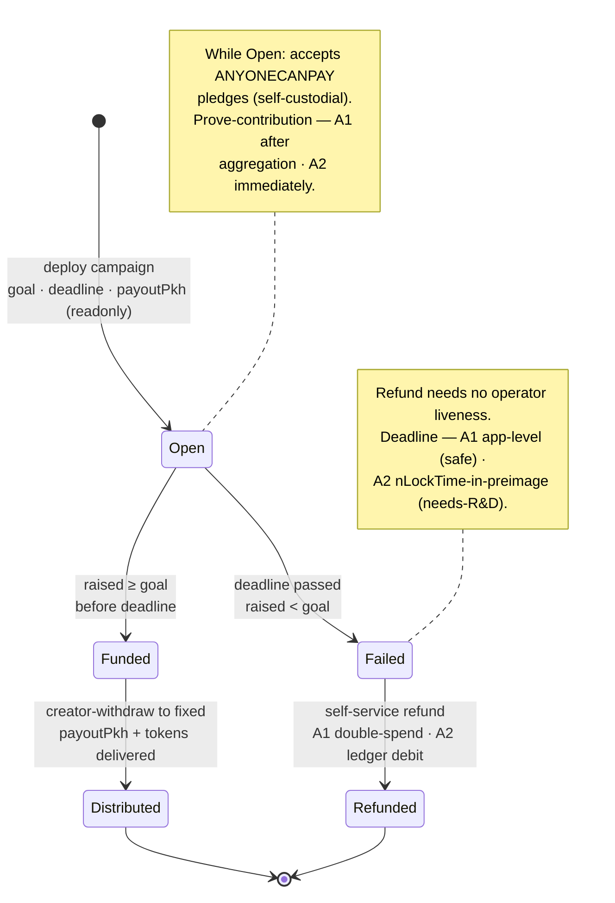
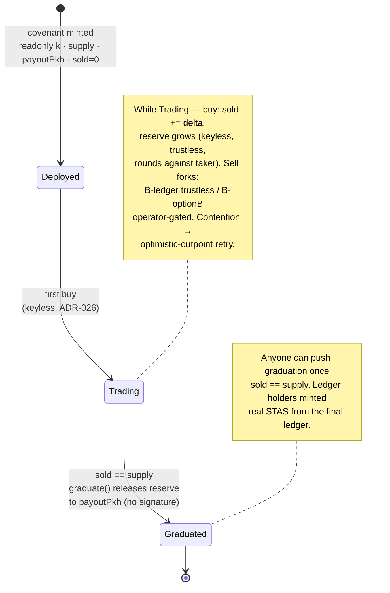

# Decentralized Crowdfunding + Bonding-Curve Launchpad — On-Chain Enforcement Strategy

**Status:** Strategy (settled brief → build direction)
**Date:** 2026-08-25
**Grounding:** DECISIONS.md ADR-024..028 · `packages/curve/src/**` · `docs/research/UTXO-CONCURRENCY-PATTERNS.md` · `docs/research/task-6-decentralized-crowdfunding-protocols.md`
**Scope:** how to build a permissionless, no-KYC funding layer on the BSV Blockchain where anything that can cause loss, locking, or misdistribution of funds is enforced on-chain, and off-chain systems only compute, index, and improve UX.

---

## 1. Executive summary

The hard parts are already proven on the BSV Blockchain mainnet, in this repository. A keyless covenant that holds a real sats reserve, enforces immutable economic terms, and prices a bonding-curve buy with no operator signature is live (ADR-026, buy tx `6bcdbb97`). A two-way curve whose holder balances live *inside* the covenant as a forgery-proof ledger — so nothing an attacker can fabricate can drain the reserve — is also live (ADR-027, buy `ca6692f6` / sell `62ab6894`, graduation built 16/16). The trustless assurance-contract intake (SIGHASH_ANYONECANPAY pledges, self-service refund, goal-gated withdraw to a fixed address) is specified and accepted (ADR-025). None of this needs to be re-derived; it needs to be assembled and wired.

There is exactly **one** money-critical operation that bounded BSV Script cannot make trustless, and it is precise: **selling a wallet-held token back to a shared reserve.** A covenant can bind a sibling input's *amount* (read it against `hashPrevouts`) but cannot verify a token's *ancestry/authenticity* — a forged STAS output is inert, but a forged AMM receipt sold back extracts real reserve sats and the drain transaction is script-valid (ADR-027). This wall bites **only** on sell-back-to-reserve. Buying, contributing, refunding, claiming, fixed-price settlement, and the in-covenant-ledger sell are all trustless-able.

The decisive strategic observation for this brief: **crowdfunding does not contain a sell-back.** Contribute → prove → refund-if-failed → claim-if-met needs no token returned to a reserve, so the entire launch/crowdfunding product sidesteps the one impossibility and can be made fully trustless. The bonding-curve AMM is the only product that touches the wall, and only on its sell side — where the repo already ships both escapes (in-covenant ledger, or wallet-STAS with an operator-gated, provenance-checked sell).

**The honest one-liner:** *On the BSV Blockchain we can make raising, refunding, and claiming money fully trustless today; we can make buying on a bonding curve fully trustless today; the only thing we cannot make trustless is selling a wallet-held token back into a shared reserve — so we either keep the token inside the covenant (fully trustless, not wallet-portable until graduation) or hand out a real wallet token and gate its sell on an operator key we must protect.*

---

## 2. Two products, two trust profiles

The brief describes what looks like one platform but is two products with materially different trust profiles. Keeping them separate is the single most clarifying design decision.

### Product A — Crowdfunding / launch (assurance contract) — fully trustless-able

All-or-nothing raise: goal, deadline, refund-if-failed, distribute-if-met. **No sell-back exists in this product**, so every money-critical operation is on-chain-enforceable. Two feasible forms:

- **A1 — ANYONECANPAY pledge aggregation (ADR-025):** contributors sign a `SIGHASH_ANYONECANPAY|ALL` (`0xC1`) pledge over a fixed target output and keep their own UTXO; nothing broadcasts until the goal is provably met. Refund = spend your own coin (a self-service double-spend, zero operator cooperation). Ships with only `@bsv/sdk` — no sCrypt toolchain. Passes the refund and no-rug-on-funds operator-disappears checks perfectly, but *prove-contribution* is only chain-visible after aggregation broadcasts, and *token claim* cannot ride the assurance transaction atomically (see §3).
- **A2 — Pooled accumulator covenant (extends ADR-027's machinery):** one evolving campaign UTXO carries `raised` in its own state plus an in-covenant contributor ledger (`ownerPkh → amount`). This is `ledgerPool.ts` minus the sell-back, so it dodges the forged-token impossibility entirely (there is no sell-to-reserve here). Contribution is an ADR-026-style covenant spend, so it is on-chain *immediately* (prove-contribution passes from the public ledger); `raised` lives in covenant state so *goal-met* is on-chain-checkable; refund is a signature-authorised self-service debit gated on `raised < goal` past deadline; creator-withdraw fires only on `raised >= goal` past deadline to a deploy-baked address. **A2 passes all four operator-disappears checks.**

### Product B — Continuous bonding-curve AMM — buy trustless; sell forks

Continuous price discovery, always-on liquidity. **Buy is fully trustless today** (ADR-026 keyless covenant, price computed and enforced in-script, rounds against the taker so truncation can never drain the reserve). **Sell hits the one wall** and forks into two accepted designs:

- **B-ledger (ADR-027) — fully trustless, no operator key:** holdings are in-covenant ledger entries proven by the holder's signature; no forgeable wallet token exists, so the reserve is drain-proof. Cost: tokens are not wallet-visible/portable STAS until a graduation step (built 16/16, not yet confirmed live), and the HashedMap/Merkle ledger is the single largest audit surface in the project.
- **B-optionB (ADR-028) — real wallet STAS, operator-gated sell:** buyers hold genuine wallet STAS; a sell runs the full back-to-genesis provenance walk off-chain (`provenance.ts`, fail-closed) before the operator co-signs. The covenant caps the payout to the curve so a malicious operator cannot *overpay* or *redirect* — only stall — but a **compromised operator key drains the whole reserve** via forged sell-branch spends. This is the accepted trade for real wallet tokens; it is explicitly *not* the trustless default.

### Brief requirement → product mapping

| Brief requirement (MUST be on-chain) | Product A (launch) | Product B (curve) | Status |
|---|---|---|---|
| Fund custody | A1: self-custodial pledge · A2: covenant reserve | Covenant reserve = the UTXO's sats | **today** |
| Core economic terms (goal, price/model, supply) | A2: `readonly` params + `raised` state | `readonly k`, `readonly supply` (`linearCurvePool.ts` L34-38) | **today** (curve) / A2 **needs-R&D** |
| Deadline | A1 app-level (safe, self-custodial) · A2 nLockTime-in-preimage | nLockTime-in-preimage / CLTV | **needs-R&D** (unbuilt as covenant) |
| Token distribution | A2 ledger→graduation mint · A1 operator-delivered | B-ledger graduation mint · B-optionB TX-B | **today** (ledger) / operator-delivered otherwise |
| Refund conditions | A1 self-service double-spend · A2 ledger debit | n/a (curve has no refund; it has sell) | **today** (A1) / A2 **needs-R&D** |
| Creator-withdrawal conditions | A2 goal-gated to fixed `payoutPkh` | `graduate()` to baked `payoutPkh` (`ledgerPool.ts` L119-124) | **today** |
| Covenants preventing arbitrary rule changes | `readonly` @props; successor must re-lock same template | same | **today** |
| Milestone *release* (evidence off-chain) | oracle-sig / preimage / timelock branch (unbuilt) | same pattern as `stasCurvePool.sell` operator gate | **needs-R&D** |

---

## 3. Feasibility matrix

`today` = proven or directly buildable on deployed primitives. `needs-R&D` = buildable on proven opcodes/patterns but not yet built/audited here. `infeasible` = a hard bounded-Script limit, not an effort gap.

| Operation / model | Enforceable on-chain today? | Operator-disappears result (chain + wallet only) | Worst-case risk |
|---|---|---|---|
| **Fund custody — curve reserve** (ADR-026/028) | **today** — reserve *is* `this.ctx.utxo.value`, no custodian key | Reserve stays locked in-covenant, spendable only via covenant branches | Preimage-parse / state-rewrite / OP_NUM2BIN width bug = permanently drainable reserve → **external audit mandatory** |
| **Fund custody — A1 pledge** (ADR-025) | **today** — funds never leave the contributor | Contributor keeps 100%; nothing to abscond with | None (self-custody); pledge key loss is a UX risk only |
| **Immutable economic terms — supply, price slope, model** | **today** — `readonly` @props + verify-an-inequality (rounds toward pool) | Terms are the script; a changed rule is a different UTXO the buyer rejects | State-int width-boundary bug (bit once, fixed 2026-08-04) — width encoding is the sharp edge |
| **On-chain deadline** | **needs-R&D** — nLockTime is in the BIP-143 preimage the covenant already parses; not yet read | A1 is safe app-level (self-custodial); A2 needs the covenant timelock built | Covenant that reads nLockTime but not nSequence (< 0xFFFFFFFF) is bypassable |
| **Refund-if-goal-unmet — A1** | **today** — self-service double-spend of own pledge | Refund with only chain + wallet — the strongest cell | None; pledges must be subset-composable to exact target (fixed denominations) |
| **Refund-if-goal-unmet — A2 pooled** | **needs-R&D** — `ledgerPool.sell`-shaped `refund(pkh,sig,proof)` gated on `raised < goal` | Pure self-service; no operator liveness | Inherits HashedMap audit surface; needs the deadline primitive |
| **Creator-withdraw only if goal met, fixed destination** | **today** — `graduate()` asserts goal then pays baked `payoutPkh`, no signature | Anyone can push graduation once goal met; creator cannot redirect or exit early | Vesting/partial-release caps beyond all-or-nothing are needs-R&D (compose CLTV branches) |
| **Token distribution — in-covenant ledger** | **today** — holders minted real STAS from final ledger at graduation | Holder proves entry by signature; a stalled operator only delays the mint | Merkle/HashedMap audit surface |
| **Token distribution — classic STAS inside assurance tx** | **infeasible** — token input must SIGHASH_ALL over an output set unknowable while pledges roll in (ADR-025) | Paid-but-undelivered if operator vanishes post-funding | Operator can stall (liveness), cannot mis-deliver (buyer SIGHASH_ALL + covenant cap bound it) |
| **Bonding-curve BUY** (ADR-026) | **today** — keyless, price enforced in-script, live tx `6bcdbb97` | Buys work *if* a client self-assembles against the current pool outpoint (needs-R&D UI) | Censorship/stall only — never mis-price or drain (rounds against buyer) |
| **Bonding-curve SELL — B-ledger** (ADR-027) | **today** — signature + inclusion-proof, no operator key, live sell `62ab6894` | Passes all four checks; a stuck operator only stalls sequencing | Largest audit surface; tokens not wallet-portable until graduation |
| **Bonding-curve SELL — B-optionB** (ADR-028) | **today (hybrid)** — covenant caps payout; operator co-signs after provenance walk | **Fails** the sell check: without the operator co-sign, tokens are stranded, reserve frozen | **Compromised operator key drains the entire reserve** → HSM-grade key custody required |
| **Wallet-held token authenticity check in-script** | **infeasible** — ancestry not checkable in bounded Script (STAS/DSTAS delegate to an off-chain indexer) | — | A forged receipt sold back drains real sats; the drain tx is script-valid |
| **Milestone RELEASE (proof exists)** | **needs-R&D** — checkSig-against-baked-oracle-pubkey / hash-preimage / timelock branch | If attestor vanishes, milestone funds stick → pair every milestone lock with an nLockTime refund escape | Attestor is an unavoidable trust anchor; a leaked oracle key releases on a forged proof |
| **Fixed-price presale** (existing `instant_swap`) | **today** — degenerate curve (constant unit price), same inequality | Intake/refund trustless via A1; delivery operator-signed | No new covenant risk beyond delivery liveness |
| **Dutch auction** | **needs-R&D** — price = f(block height) via nLockTime/CLTV in preimage; shardable | Per-buyer fill independent if paid as self-custodied pledge (inherits A1 refund) | Net-new covenant = new audit surface |
| **Batch / uniform-clearing auction** | **needs-R&D (clearing)** — bids are ANYONECANPAY pledges (trustless intake/refund); clearing price operator-computed | Bidders reclaim pledges trustlessly; auction may simply not clear | Operator could compute an unfair clear → publish all bids so anyone can recompute |
| **Time-based vesting** | **today** — CLTV tranches, each an independent UTXO | Tranches release on schedule regardless of operator | Milestone-based vesting inherits attestor trust |

---

## 4. Trust boundaries

On-chain-enforced components are the authority for anything that can lose, lock, or misdistribute funds. Off-chain components compute, index, and improve UX — never a required authority to execute the protocol.

---

## 5. Transaction flows

### 5(a) — Trustless assurance contract: contribute → refund-if-failed → claim-if-met

### 5(b) — Trustless bonding-curve BUY (ADR-026, no operator signature)

### 5(c) — Curve SELL: B-ledger (trustless) vs B-optionB (operator-gated) side by side

_B-ledger (ADR-027) — fully trustless._

---

## 6. State machines

### Assurance-contract campaign lifecycle

### Bonding-curve pool lifecycle

---

## 7. Scale strategy

This reconciles with `docs/research/UTXO-CONCURRENCY-PATTERNS.md`, which recommends UTXO sharding (its Pattern 1) for 10-25 concurrent contributions. That recommendation stands — but it must be **scoped**, because the prior file did not distinguish fee-fuel sharding from price-covenant sharding, and conflating them would be money-critical.

**Base case is already solved — build nothing new.** The brief's stated load is 20-30 projects × ~6k-10k each, mostly few contributors, project isolation the priority. One covenant per project already yields 20-30 independent serial ancestor chains (Pattern 3, "already implemented — no code change needed"). "Few contributors" never approaches the 25-unconfirmed-ancestor wall, and the deployed optimistic-outpoint retry (`recordCurveBuy` / `recordStasBuy`) resolves the rare 2-3 concurrent collisions per project in sub-second rebuilds. **Project isolation is the primary axis and it is free.**

**What sharding is FOR, and what it must NOT touch.** Pre-splitting into N shards is correct and endorsed for two things only:
- **Operator fee-fuel UTXOs** — the sats that pay miner fees and fund delivery TX-B; these carry no evolving price, so sharding them just prevents the operator's own fee chain from hitting 25 ancestors during a burst (`getOperatorBaseUtxos` already selects the lowest-unconfirmed-depth base).
- **Fixed-price inventory** — constant unit price means K parallel inventory UTXOs are independent with no reconciliation.

**A bonding-curve price covenant is fundamentally un-shardable.** Price = f(sold) is endogenous cumulative state. Split it into K reserve UTXOs and you get K parallel *cheaper* sub-curves (monotonicity break), and reconciling a global `sold` across shards is impossible in bounded Script (no global mutable state). Applying Pattern 1 to the *price* covenant lets an arbitrageur buy the low end of every shard simultaneously and systematically underprice the project — an economic-terms integrity failure. **Do not shard the curve price covenant.**

**The correct viral-edge lever for a hot curve is BATCH SETTLEMENT — and it needs zero covenant change.** Because `curveCost(k, S, ΣΔ)` is the exact curve integral, N buys totaling ΣΔ price identically to one buy of ΣΔ; the operator collapses a burst into one covenant hop (`S → S+ΣΔ`) that prices every unit at its correct marginal position. Trustless pricing is preserved and the reserve stays undrainable (the covenant caps the aggregate cost). The cost is operator-attested *intra-batch fills* — a strict subset of ADR-028's already-accepted operator sequencing/delivery trust. Note the boundary: batching a *keyless* trustless buy sacrifices the per-buyer SIGHASH_ALL anti-shortchange gate (a covenant Merkle-root-of-orders binds amounts, not consent), so **keep batching for the operator-gated STAS variant** and keep the pure-trustless curve un-batched behind retry.

**Steer viral-expecting projects to shard-friendly models.** Fixed-price presale (already shipped as `instant_swap`; constant price, inventory pre-splittable) and batch/uniform-clearing auctions (no evolving on-chain state during bidding — bids are ANYONECANPAY pledges, ADR-025) are the most contention-immune. A Dutch auction is shardable because its price is a function of block height, not sold, so K inventory UTXOs compute an identical price with zero cross-shard state.

**What is premature right now:** UTXO sharding of anything at year-1 scale (project isolation already covers it); batch-settlement plumbing (design it, do not build it until observed load triggers it); merkle-state overlay settlement (`UTXO-CONCURRENCY-PATTERNS.md` Pattern 4 — a 3-6 month build for a sub-1% gain over sharding, DEX-scale only).

---

## 8. Recommended phased roadmap

The strategy is **reuse the proven primitives, own the assembly.** External survey found no production BSV token launchpad — the moat is integration and audit, not primitive invention. Lead with the one missing trustless primitive; position operator-assisted paths as explicitly-labelled convenience variants, never the default.

### Phase 0 — Ship the trustless launch intake (weeks)
- **Build:** wire ADR-025 A1 pledges as the fixed-price presale intake. Only `@bsv/sdk` (`0xC1` preimage, `wallet.createSignature({ hashToDirectlySign })`, no broadcast). Public pledge registry as advisory index.
- **Delivers:** trustless fund custody + trustless refund (self-service double-spend) with zero new toolchain. This is build-order item (1), "fixed-price presale first," made genuinely trustless on intake/refund. Delivery remains operator-signed (labelled honestly as liveness-soft, never misdistribution-soft).

### Phase 1 — Wire the proven trustless BUY (weeks)
- **Build:** the client that resolves the latest pool outpoint (overlay `LookupResolver` / SPV-carrying BEEF) and assembles an ADR-026 buy **without the operator backend** — the remaining work is UI + outpoint resolution, not new Script. Keep the optimistic-outpoint retry.
- **Delivers:** the brief's ~Level-4 primary target — any frontend can trigger a decentralized buy, next price computed and enforced on-chain, no operator. Covenant already proven live (`6bcdbb97`).

### Phase 2 — Build the trustless assurance-accumulator covenant (the missing primitive)
- **Build:** A2 — the pooled accumulator from `ledgerPool.ts` minus the sell-back: `raised` in covenant state, contributor ledger, `refund(pkh,sig,proof)` gated on `raised < goal`, `graduate()`-style withdraw to a baked `payoutPkh` on `raised >= goal`. Add the **on-chain deadline** primitive (read nLockTime from the pushed BIP-143 preimage; pin `nSequence < 0xFFFFFFFF`).
- **Delivers:** the only design where **all four operator-disappears checks pass** — closes A1's two gaps (on-chain prove, on-chain claim/no-delivery-rug). This is the fixed-price presale made *truly* on-chain and it shares the curve's toolchain.

### Phase 3 — Bonding-curve SELL, trustless-first
- **Build (default):** B-ledger (ADR-027) as the flagship two-way curve — trustless sell, no operator key, live buy/sell already demonstrated. Confirm the graduation mint live on mainnet.
- **Build (labelled variant):** B-optionB (ADR-028) offered explicitly as **"instant liquidity — operator-assisted"**, never the default: real wallet STAS, sell gated on the fail-closed provenance walk, covenant-capped payout. Ship it with the operator-key-security requirements from §9 front-and-centre.

### Phase 4 — Alternative models + scale levers (on demand)
- **Build when a project needs it:** Dutch auction (block-height price covenant), batch/uniform-clearing auction (ANYONECANPAY intake + operator-published clearing anyone can recompute), time-based vesting (CLTV tranches). Design batch-settlement for hot curves now; build it only when observed load triggers it. Fee-fuel and fixed-price inventory sharding per `UTXO-CONCURRENCY-PATTERNS.md` Pattern 1 — **never the curve price covenant.**

---

## 9. Risk assessment

### Operator-disappears, per model (chain + wallet only)

| Model | Contribute/Buy | Refund | Claim tokens | Creator can't rug | Verdict |
|---|---|---|---|---|---|
| A1 assurance presale (ADR-025) | after aggregation | **pass** (double-spend) | fail (delivery operator-signed) | pass (funds self-custodial) | strongest refund; delivery liveness-soft |
| A2 pooled accumulator | **pass** (covenant ledger) | **pass** (ledger debit) | pass (ledger→graduation mint) | **pass** (`raised`-gated to fixed addr) | **all four pass** — the trustless core |
| Curve BUY (ADR-026) | **pass** if client self-assembles | n/a | n/a | pass (keyless, capped) | trustless; censorship/stall only |
| B-ledger SELL (ADR-027) | **pass** | n/a | **pass** (sig + proof) | pass | trustless; not wallet-portable pre-graduation |
| B-optionB SELL (ADR-028) | pass (buy) | **fail** (no co-sign → stranded) | operator-delivered | payout capped, but key = drain | weakest cell; hybrid, labelled |
| Milestone release | n/a | escape-hatch nLockTime needed | attestor-gated | attestor trust anchor | second-weakest; pair with timelock refund |

### Reserve-drain vectors (the money-critical class)

- **Covenant math / serialization bug** (preimage parse, state rewrite, **OP_NUM2BIN width encoding**) — a permanently drainable reserve. The `sold=0` state-length-boundary bug already bit once and was fixed (ADR-028, 2026-08-04): width encoding is the demonstrated sharp edge.
- **Compromised Option B operator key** — the single highest-value target in the system: a leaked co-sign key drains the whole reserve via forged sell-branch spends, with no seller involvement (FIX-3 payee-binding was reverted as moot precisely because a compromised key already drains regardless).
- **Forged wallet-token sell-back** — inert against the ledger model (no forgeable token exists); against Option B it is blocked *off-chain* by the fail-closed `provenance.ts` walk before co-sign — an advisory guard, not in-script enforcement.
- **Leaked oracle/attestor key** — releases milestone funds on a forged proof.

### Mandatory pre-launch guards

1. **External covenant audit before any non-trivial reserve** — non-negotiable per ADR-026/027. The `linearCurvePool` / `ledgerPool` / `stasCurvePool` math, preimage handling, and successor-serialization are the audit target; the HashedMap/Merkle ledger is the single largest surface.
2. **Mainnet-small-first** — test every covenant with trivial sats before any real raise (Golden Rule 2, and `task-6` security lesson from TheDAO: trustless systems still fail if the code is wrong).
3. **HSM-grade custody for the Option B operator key** — it is reserve-critical; treat it as the crown jewel, or do not offer Option B.
4. **Every milestone/time lock paired with an nLockTime refund escape** — so contributors reclaim with chain + wallet if an attestor or operator vanishes (`task-6` Design Principle 1).
5. **Honest labelling** — Option B and operator-delivered classic-STAS distribution are liveness-soft and (Option B) key-critical; label them as such in-product. Never present a batched or operator-gated path as fully trustless.

---

## 10. Open questions / R&D

1. **HashedMap / fixed-depth SMT audit surface (ADR-027).** The in-covenant ledger is the flagship trustless-sell path *and* the largest audit surface. Open: is scrypt-ts `HashedMap` production-safe at O(holders) growth, or is a hand-rolled fixed-depth SMT the safer primitive? Validate before any non-trivial ledger pool. No live-mainnet HashedMap ledger-pool precedent exists externally.
2. **On-chain deadline as a covenant primitive.** nLockTime is in the BIP-143 preimage the covenants already parse; building and auditing a CLTV-style branch (with the `nSequence < 0xFFFFFFFF` pin and block-height/MTP unit discipline) is unbuilt. Off-by-one on the boundary block is a known covenant bug class.
3. **Milestone attestation / oracle model.** The release *branch* is buildable (checkSig-vs-baked-pubkey, exactly `stasCurvePool.sell`'s gate; or hash-preimage; or timelock). Open: who attests, and how to reduce the trust anchor — single key vs threshold/multisig oracle — knowing Script can only ever enforce "this signature exists," never "the work was done."
4. **Batch-settlement covenant for hot curves.** Additive `curveCost` makes trustless *aggregate pricing* free, but per-buyer fill consent is lost without an interactive round the public-buy model lacks. Open: is there a Merkle-root-of-orders construction that binds per-buyer consent without interactivity, or is operator-attested fill the accepted ceiling for batched curves?
5. **Permissionless graduation-mint.** ADR-027 graduation is a keyless branch, but converting ledger entries to wallet-visible STAS is currently an operator-run mint (liveness-soft, never misdistribution-soft). Open: can the graduation mint be made permissionless so even the liveness dependency is removed?
6. **Overlay hosting decentralisation.** Overlay topics + `LookupResolver` remove DB-trust for outpoint resolution (Level-4 enabler), but until third-party hosts adopt the launchpad topic, the operator runs the only host — removing DB-trust, not liveness-trust. Open: bootstrap path to independent overlay hosts.
7. **Sharded-goal reconciliation for viral A2 raises.** If a single accumulator campaign goes viral and must shard, `raised` splits across shards and "goal-met" must sum shard reserves in one merge tx at deadline — a real design wrinkle only if/when a project needs it (year-1 scale does not).
8. **TAAL / stas-js commercial licence (ADR-021).** An unresolved pre-launch *business* dependency for the classic-STAS distribution rail — flagged here so it is not rediscovered at launch.
